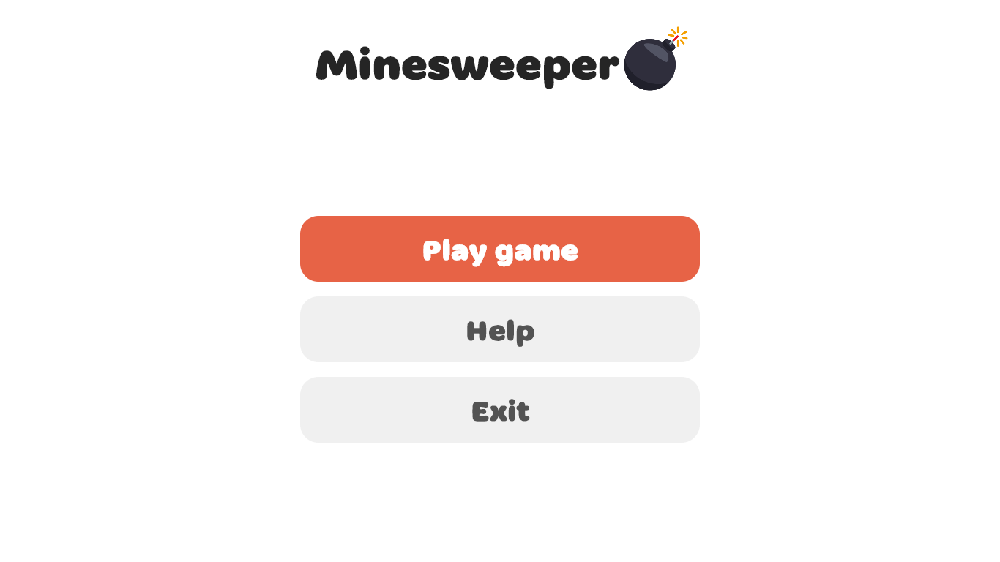
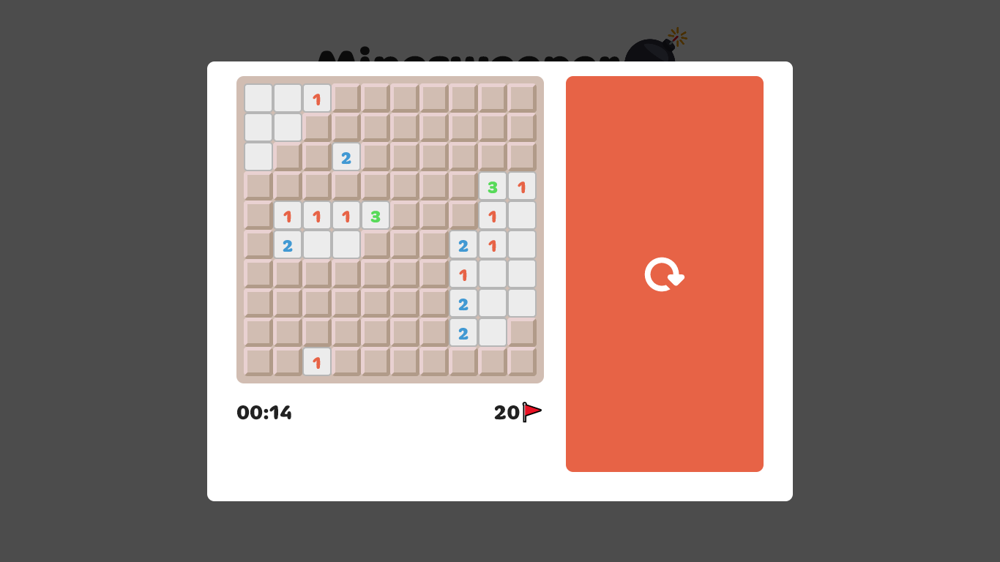

 
<h1 align="center"><b>Minesweeper</b></h1>
<h4 align="center">Another one minesweeper</h4>

<a href="#screenshots">Screenshots</a> &bull; <a href="#installation">Installation</a> &bull; <a href="#credits">Credits</a>

## Screenshots

## Installation

* <a href="https://github.com/pink-eye/Minesweeper/releases/download/v1.0.0/setup_minesweeper-1.0.0.exe" alt="link to exe file">Windows installer</a>
* <a href="https://github.com/pink-eye/Minesweeper/releases/download/v1.0.0/minesweeper-1.0.0.zip" alt="link to exe file">ZIP-package</a>

## Credits

App icon from <a href="flaticon.com" alt="link to flaticon">flaticon</a>
